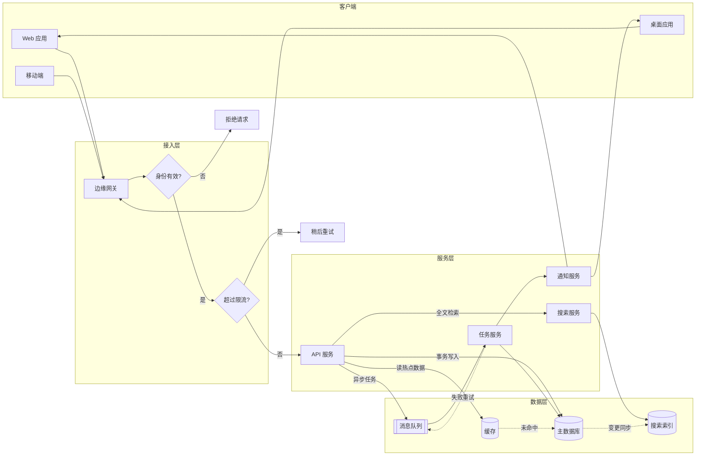
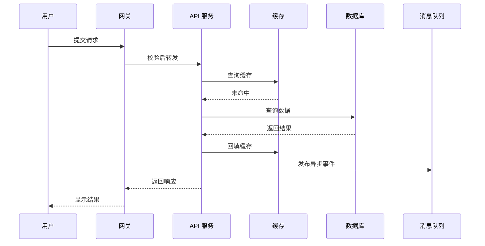

# 复杂 Mermaid 排版测试

这个文档用于检查宽度变化、复杂流程图的节点间距、边标签和跨分组连线。

## 多分组流程图

```mermaid
flowchart LR
    subgraph Client[客户端]
        WEB[Web 应用]
        DESKTOP[桌面应用]
        MOBILE[移动端]
    end

    subgraph Gateway[接入层]
        EDGE[边缘网关]
        AUTH{身份有效?}
        LIMIT{超过限流?}
    end

    subgraph Services[服务层]
        API[API 服务]
        SEARCH[搜索服务]
        JOB[任务服务]
        NOTIFY[通知服务]
    end

    subgraph Data[数据层]
        CACHE[(缓存)]
        DB[(主数据库)]
        INDEX[(搜索索引)]
        QUEUE[[消息队列]]
    end

    WEB --> EDGE
    DESKTOP --> EDGE
    MOBILE --> EDGE
    EDGE --> AUTH
    AUTH -->|否| REJECT[拒绝请求]
    AUTH -->|是| LIMIT
    LIMIT -->|是| RETRY[稍后重试]
    LIMIT -->|否| API
    API -->|读热点数据| CACHE
    CACHE -.未命中.-> DB
    API -->|事务写入| DB
    API -->|全文检索| SEARCH
    SEARCH --> INDEX
    API -->|异步任务| QUEUE
    QUEUE --> JOB
    JOB --> DB
    JOB --> NOTIFY
    NOTIFY --> WEB
    NOTIFY --> DESKTOP
    DB -.变更同步.-> INDEX
    JOB -.失败重试.-> QUEUE
```

## 时序图

```mermaid
sequenceDiagram
    participant U as 用户
    participant G as 网关
    participant A as API 服务
    participant C as 缓存
    participant D as 数据库
    participant Q as 消息队列
    U->>G: 提交请求
    G->>A: 校验后转发
    A->>C: 查询缓存
    C-->>A: 未命中
    A->>D: 查询数据
    D-->>A: 返回结果
    A->>C: 回填缓存
    A->>Q: 发布异步事件
    A-->>G: 返回响应
    G-->>U: 显示结果
```
