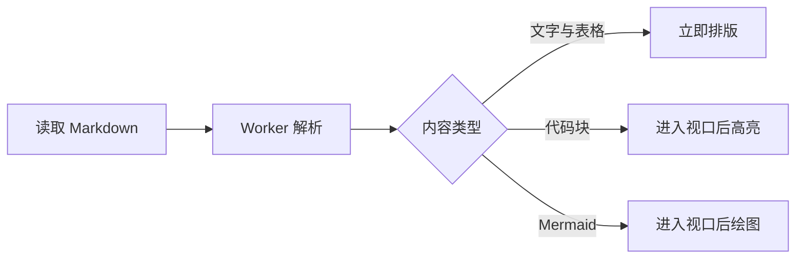
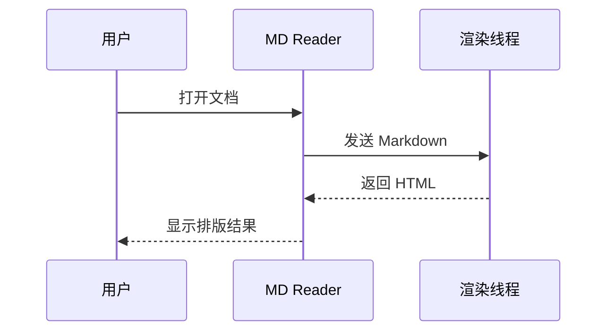

# Mermaid 图表示例

MD Reader 只在图表接近视口时加载 Mermaid，普通 Markdown 的打开速度不受影响。

## 流程图



## 时序图



## 普通代码块

```typescript
export function fastRender(markdown: string): Promise<string> {
  return renderer.render(markdown);
}
```
